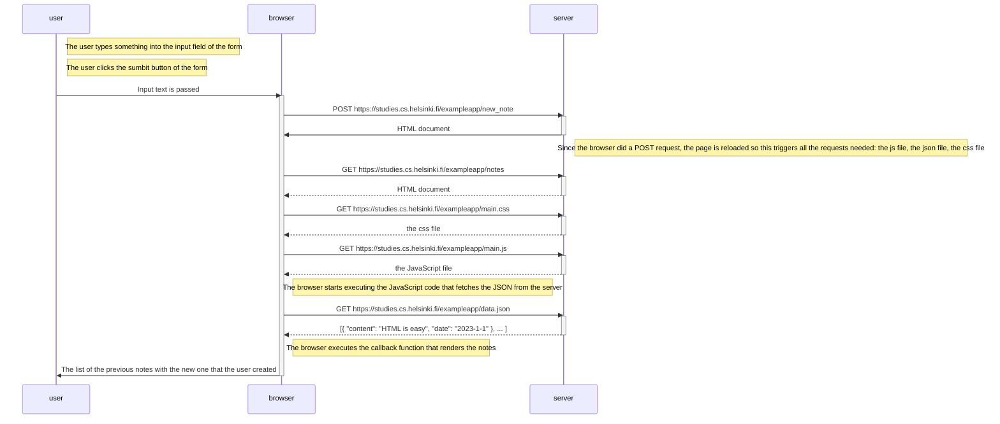

```mermaid
sequenceDiagram
  participant user
  participant browser
  participant server
  Note right of user: The user types something into the input field of the form
  Note right of user: The user clicks the sumbit button of the form
  user->>browser: Input text is passed
  activate browser
  browser->>server: POST https://studies.cs.helsinki.fi/exampleapp/new_note
  activate server
  server->>browser: HTML document
  deactivate server
  Note right of server: Since the browser did a POST request, the page is reloaded so this triggers all the requests needed: the js file, the json file, the    css file
  browser->>server: GET https://studies.cs.helsinki.fi/exampleapp/notes
  activate server
  server-->>browser: HTML document
  deactivate server

  browser->>server: GET https://studies.cs.helsinki.fi/exampleapp/main.css
  activate server
  server-->>browser: the css file
  deactivate server

  browser->>server: GET https://studies.cs.helsinki.fi/exampleapp/main.js
  activate server
  server-->>browser: the JavaScript file
  deactivate server

  Note right of browser: The browser starts executing the JavaScript code that fetches the JSON from the server

  browser->>server: GET https://studies.cs.helsinki.fi/exampleapp/data.json
  activate server
  server-->>browser: [{ "content": "HTML is easy", "date": "2023-1-1" }, ... ]
  deactivate server

  Note right of browser: The browser executes the callback function that renders the notes
  browser->>user: The list of the previous notes with the new one that the user created
  deactivate browser
```
