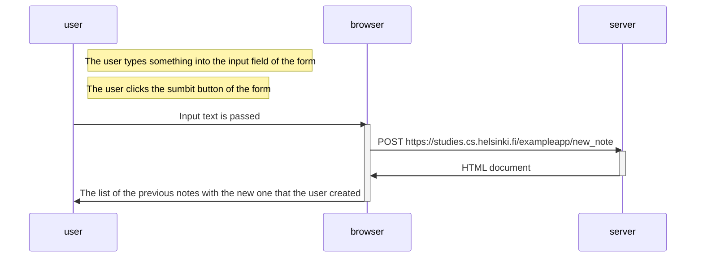

```mermaid
sequenceDiagram
  participant user
  participant browser
  participant server
  Note right of user: The user types something into the input field of the form
  Note right of user: The user clicks the sumbit button of the form
  user->>browser: Input text is passed
  activate browser
  browser->>server: POST https://studies.cs.helsinki.fi/exampleapp/new_note
  activate server
  server->>browser: HTML document
  deactivate server
  browser->>user: The list of the previous notes with the new one that the user created
  deactivate browser
```
