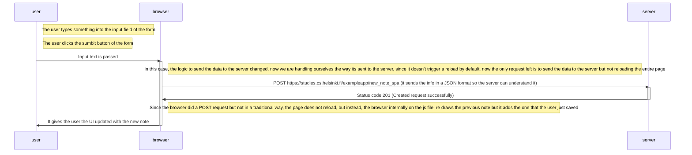

```mermaid
sequenceDiagram
  participant user
  participant browser
  participant server
  Note right of user: The user types something into the input field of the form
  Note right of user: The user clicks the sumbit button of the form
  user->>browser: Input text is passed
  activate browser
  Note right of browser: In this case, the logic to send the data to the server changed, now we are handling ourselves the way its sent to the server, since it doesn't trigger a reload by default, now the only request left is to send the data to the server but not reloading the entire page
  browser->>server: POST https://studies.cs.helsinki.fi/exampleapp/new_note_spa (it sends the info in a JSON format so the server can understand it)
  activate server
  server->>browser: Status code 201 (Created request successfully)
  deactivate server
  Note right of browser: Since the browser did a POST request but not in a traditional way, the page does not reload, but instead, the browser internally on the js file, re draws the previous note but it adds the one that the user just saved
  browser->>user: It gives the user the UI updated with the new note
  deactivate browser
```
